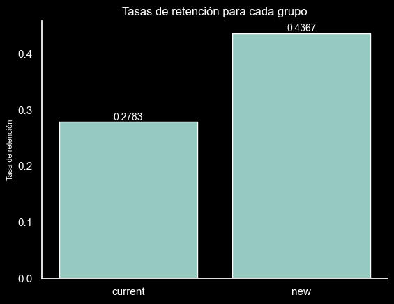

🎮 A/B Testing en una empresa de videojuegos

📖 Descripción

Una empresa de juegos ha creado un modo de juego nuevo que quiere añadir al modo de juego actual. La empresa espera que el nuevo modo de juego aumente la tasa de retención de los usuarios en 1 día del 32% actual al 35%.

El dataset presenta las siguientes columnas:  
- user_id: id de cada usuario  
- version: versión del modo de juego que tiene cada usuario; "current" será el grupo control y "new" el grupo test.  
- retention_day1: valor booleano que indica si el usuario vuelve a jugar en 1 día o no.  

📁 Estructura del Proyecto

    ├── data/                # Datos crudos
    ├── Proyecto             # Jupyter notebooks con el desarrollo de cálculos  
    ├── src/                 # Archivo con funciones de soporte
    ├── README.md            # Descripción del proyecto

🛠️ Instalación y Requisitos

- Python: Versión 3.13.0
- Jupyter Notebook (ejecutado a través de VSCode)
- Librerías: 
    - pandas 
    - numpy 
    - seaborn 
    - matplotlib
    - scipy
    - statsmodels
    

Para más detalles puedes consultar el archivo requirements.txt

📊 Resultados y Conclusiones  
- Las hipótesis planteadas han sido:  
    - $H0$: No hay diferencia en la tasa de retención en un día entre el modo de juego actual y el modo nuevo.   
    - $H1$: La tasa de retención en 1 día es más alta en el modo nuevo.  
- La representación de la tasa de retención media de ambos grupos, muestra que el grupo test tiene una retención promedio significativamente mayor.   
       
- Se ha realizado un z-test y se ha obtenido un p-valor de 0.0, lo que unido al gráfico, permite descartar la hipótesis nula y afirmar que el modo de juego nuevo consigue una mayor tasa de retención en 1 día.

🔄 Próximos Pasos

    

🤝 Contribuciones

Las contribuciones son bienvenidas. Si deseas mejorar el proyecto, por favor abre un pull request o una issue. 

✒️ Autores y Agradecimientos

Marta María Llordén Alonso - @MartaM1206